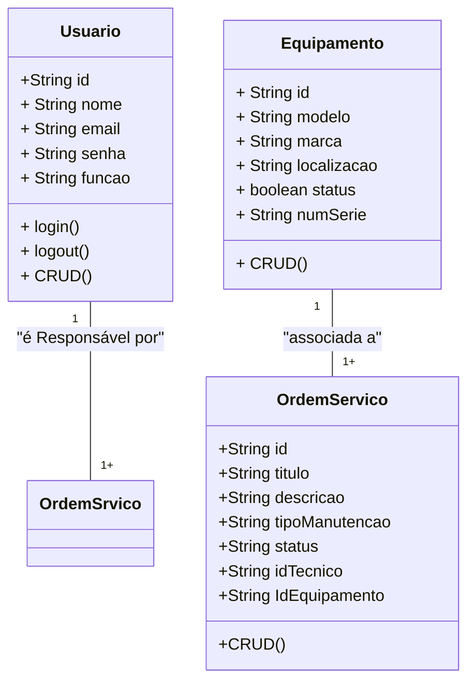

# Sistema de Gestão de Manutenção (SGM) - Formativa

## Briefing

O projeto consiste no desenvolvimento de um Sistema de Gestão de Manutenção (SGM) no formato de uma aplicação web. O objetivo é centralizar e otimizar o controle das atividades de manutenção de máquinas e equipamentos de uma empresa. A plataforma permitirá o cadastro de equipamentos, agendamento de manutenções preventivas e corretivas, e o gerenciamento de ordens de serviço.

## Objetivo do Projeto

- Gerenciar informações sobre equipamentos e manuteção
  realizadas pela empresa
- Realizar abertura de chamados de manutenção (ordens de serviço)
- Proteger acesso aos dados do sistema (criptografia e autenticação segura de usuários)

## Público-Alvo

- Tecnicos de Manutenção (usuarios finais)
- Gestores de Manutenção (usuários intermediários)
- Administradores do Sistema (Gerenciar a permissão dos usuários)

## Levantamento de Requisitos do Projeto

- ### Requisitos Funcionais

- ### Requisitos Não Funcionais

## Recursos do Projeto

- ### Tecnológicos
  - Framework de Desenvolvimento Next/React
  - Linguagem de Programação: TypeScript
  - Banco de Dados: Não Relacional (MongoDB)
  - GitHub
  - VsCode
  - Figma
- ### Pessoal
  - Dev Tudo

## Análise de Risco

## Diagramas

1.  ### Classe

    Descrever o comportamento das Entidades de um Projeto - Usuário (User/Usuario) - Atributos: id, nome, email, senha, função - métodos:create, read, update, delete, login, logout - Equipamento (Equipment/Equipamento) - Atributos: id, modelo, marca, localização, status, numeroSerie - Métodos: CRUD

        - Ordem de Serviço (OrdemServico)
            - Atributos: id, titulo, descricao, tipoManutenção,
            status, idTecnico, IdEquipamento

