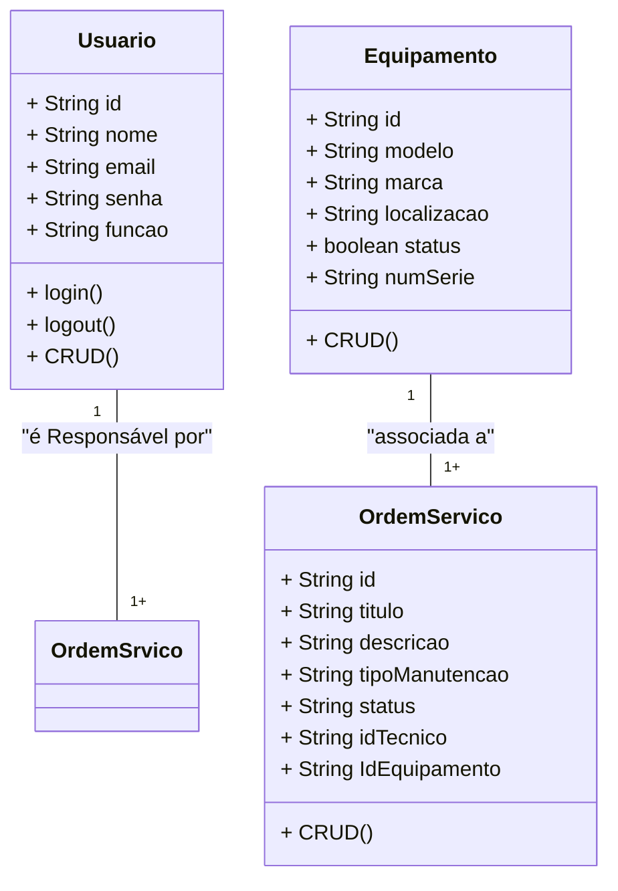
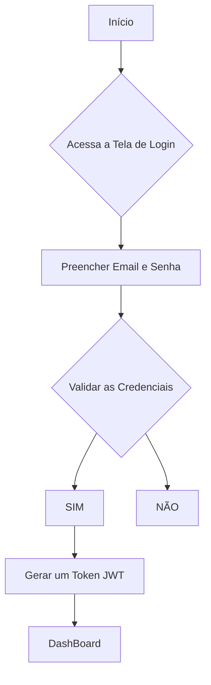

# Sistema de Gestão de Manutenção (SGM) - Formativa

## Briefing

O projeto consiste no desenvolvimento de um Sistema de Gestão de Manutenção (SGM) no formato de uma aplicação web. O objetivo é centralizar e otimizar o controle das atividades de manutenção de máquinas e equipamentos de uma empresa. A plataforma permitirá o cadastro de equipamentos, agendamento de manutenções preventivas e corretivas, e o gerenciamento de ordens de serviço.

## Objetivo do Projeto

- Gerenciar informações sobre equipamentos e manuteção
  realizadas pela empresa
- Realizar abertura de chamados de manutenção (ordens de serviço)
- Proteger acesso aos dados do sistema (criptografia e autenticação segura de usuários)

## Público-Alvo

- Tecnicos de Manutenção (usuarios finais)
- Gestores de Manutenção (usuários intermediários)
- Administradores do Sistema (Gerenciar a permissão dos usuários)

## Levantamento de Requisitos do Projeto

- ### Requisitos Funcionais

- ### Requisitos Não Funcionais

## Recursos do Projeto

- ### Tecnológicos
  - Framework de Desenvolvimento Next/React
  - Linguagem de Programação: TypeScript
  - Banco de Dados: Não Relacional (MongoDB)
  - GitHub
  - VsCode
  - Figma
- ### Pessoal
  - Dev Tudo

## Análise de Risco

## Diagramas

1.  ### Classe

    Descrever o comportamento das Entidades de um Projeto - Usuário (User/Usuario) - Atributos: id, nome, email, senha, função - métodos:create, read, update, delete, login, logout - Equipamento (Equipment/Equipamento) - Atributos: id, modelo, marca, localização, status, numeroSerie - Métodos: CRUD

        - Ordem de Serviço (OrdemServico)
            - Atributos: id, titulo, descricao, tipoManutenção,
            status, idTecnico, IdEquipamento



2. ### Casos de Uso
Ilustra as interações dos diferentes tipos de usuários (Atores) com as funcionalidade do sistema

- Caso de Uso:
    - Técnico: Gerenciar Ordens de Serviço (CRUD) e acessar o Dashboard
    - Gerente: funções do técnico + Gerenciamento de Equipamentos (CRUD);
    - Admin: Gerenciar Usúarios do Sistema, acessar o Dashboard

    Fazer o login -> Antes de  qualquer Ação

    ```mermaid

graph TD

    subgraph "SGM"
        caso1([Fazer Login])
        caso2([Gerenciar Ordens de Srviço - CRUD])
        caso3([Gerenciar Equipamentos - CRUD])
        caso4([Gerenciar Usuários])
        caso5([Acessar o DashBoard])
    end

    Tecnico([Técnico de Manutenção])
    Gerente([Gerente de Manutenção])
    Admin([Administrador do Sistema])

    Tecnico --> caso1
    Tecnico --> caso3
    Tecnico --> caso5

    Gerente --> caso1
    Gerente --> caso2
    Gerente --> caso3
    Gerente --> caso5

        Admin --> caso1
    Admin --> caso4
    Admin --> caso5

    caso1 -.-> caso2
    caso1 -.-> caso3
    caso1 -.-> caso4
    caso1 -.-> caso5
    
    Admin --> caso1
    Admin --> caso4
    Admin --> caso5

    caso1 -.-> caso2
    caso1 -.-> caso3
    caso1 -.-> caso4
    caso1 -.-> caso5
    
```
3. ### Fluxo
Detalha o passo a passo para realizar uma ação no sistema

- Diagrama de fluxo de Login
    - O usuário acessa a tela de login
    - Insere as credenciais
    - O sistema verifica as Credenciais
        - se sim: ger um JWT (Token) => Dashboard
        - se não: manda uma mensagem de erro - Permanece na tela de Login

