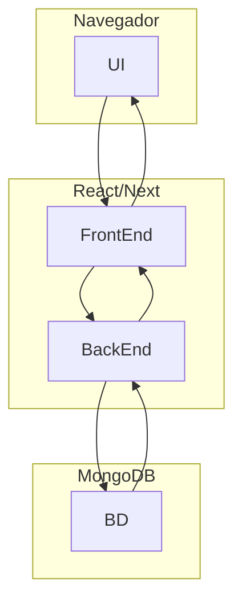

# criar um Diagrama de Arquitetura usando Mermaid

## Trabalhando com MongoDB

### meu Banco de Dados
use minhaLojaSESIA;

### criar um Obj em uma Coleção
db.produtos.insertOne(
    {
        nome: "Tablet 10",
        marca: "Multilaser",
        valor: 800.00,
        disponibilidade: true,
        especificacoes:{
            processador:"quadCore",
            ram: "8GB",
            armazenamento:"64GB"
        },
        cores:["Azul","Rosa","Cinza","Preto"]
    }
);

### listar produtos 
db.produtos.find();

### listar especifico

